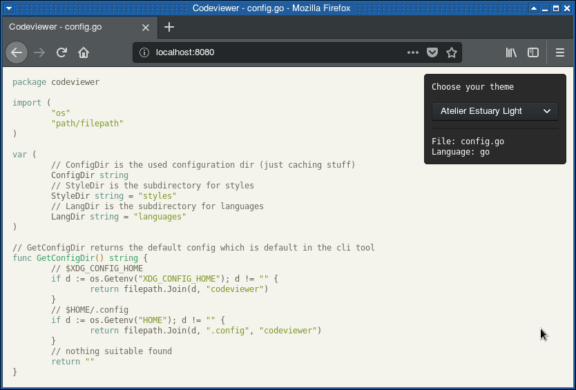

# Codeviewer
This is just a fun project to look at your source code syntax highlighted in the browser.

It uses [hljs](https://highlightjs.org/) and is written in Go and JavaScript.



(The theme chooser can be toggled with `CTRL`)

## Usage
```bash
git clone https://github.com/mbndr/codeviewer
cd codeviewer
go build -o codeviewer cmd/main.go
./codeviewer download # Download all hljs files to your local cache ($HOME/.config)
./codeviewer serve -f myFile.go
```